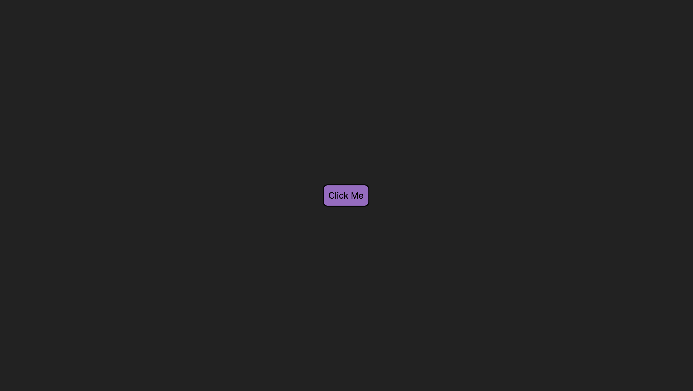
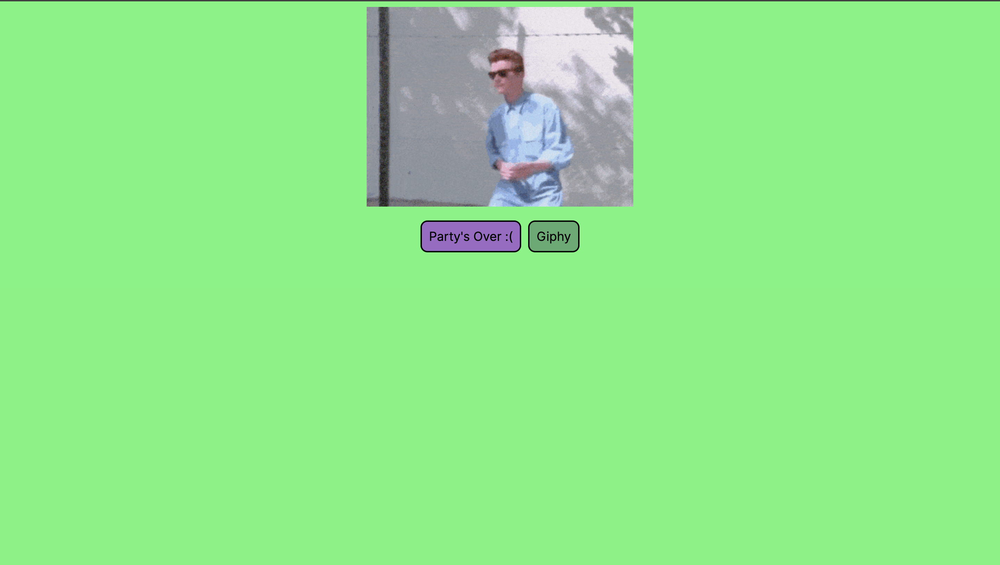

# dance-party

This is a simple applicatoin that allows a user trigger a "dance party."

The user can click a suspicious looking button to cause the background to generate random colors - simulating dance lights.

A random dancing gif - referencing a giphy query search term "dance" - will appear

The user can then click giphy, to display random dance gifs

# Future Fixes

1. Only retrieves 50 results due to 50 results per page on Giphy. Updating code to handle pagination in the API request by making additional requests to fetch subsequent pages.

2. Music. Maybe an mp3 file to trigger music when the click me button is clicked.

3. Revise random gif functionality to avoid the same gif from displaying
